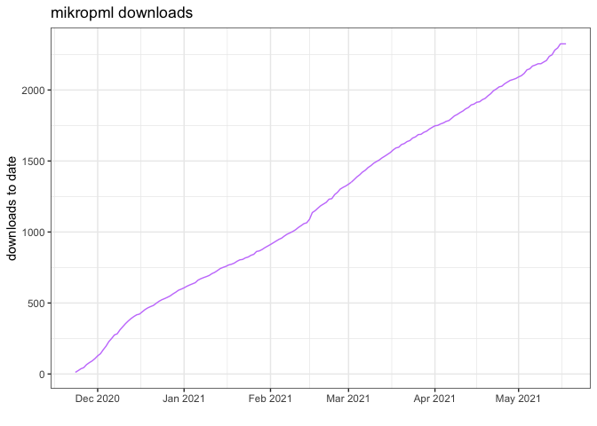

<!-- README.md is generated from README.Rmd. Please edit that file -->

# pkg-downloads

<!-- badges: start -->

[](https://github.com/kelly-sovacool/pkg-downloads/actions)
<!-- badges: end -->

[`mikropml`](https://github.com/SchlossLab/mikropml) package download
counts from `cranlogs`

## Download the downloads

``` r
library(tidyverse)
#> ── Attaching packages ─────────────────────────────────────── tidyverse 1.3.1 ──
#> ✓ ggplot2 3.3.3     ✓ purrr   0.3.4
#> ✓ tibble  3.1.1     ✓ dplyr   1.0.6
#> ✓ tidyr   1.1.3     ✓ stringr 1.4.0
#> ✓ readr   1.4.0     ✓ forcats 0.5.1
#> ── Conflicts ────────────────────────────────────────── tidyverse_conflicts() ──
#> x dplyr::filter() masks stats::filter()
#> x dplyr::lag()    masks stats::lag()
downloads <- cranlogs::cran_downloads(package = "mikropml",
                                      from = "2020-11-23") %>%
    mutate(cum_count = cumsum(count))
write_csv(downloads, here::here('data', 'downloads.csv'))
head(downloads)
#>         date count  package cum_count
#> 1 2020-11-23    12 mikropml        12
#> 2 2020-11-24    12 mikropml        24
#> 3 2020-11-25    13 mikropml        37
#> 4 2020-11-26     8 mikropml        45
#> 5 2020-11-27    21 mikropml        66
#> 6 2020-11-28    14 mikropml        80
```

## Plot over time

``` r
downloads %>% 
    ggplot(aes(date, cum_count)) + 
    geom_line(color = '#c882fc') + 
    scale_x_date(date_labels = "%b %Y") + 
    theme_bw() + 
    labs(x = '', y = 'downloads to date', title = 'mikropml downloads')
```

<!-- -->
