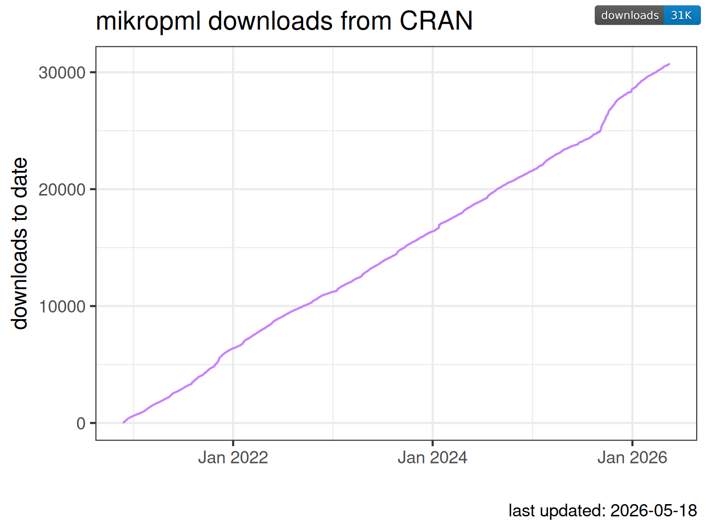
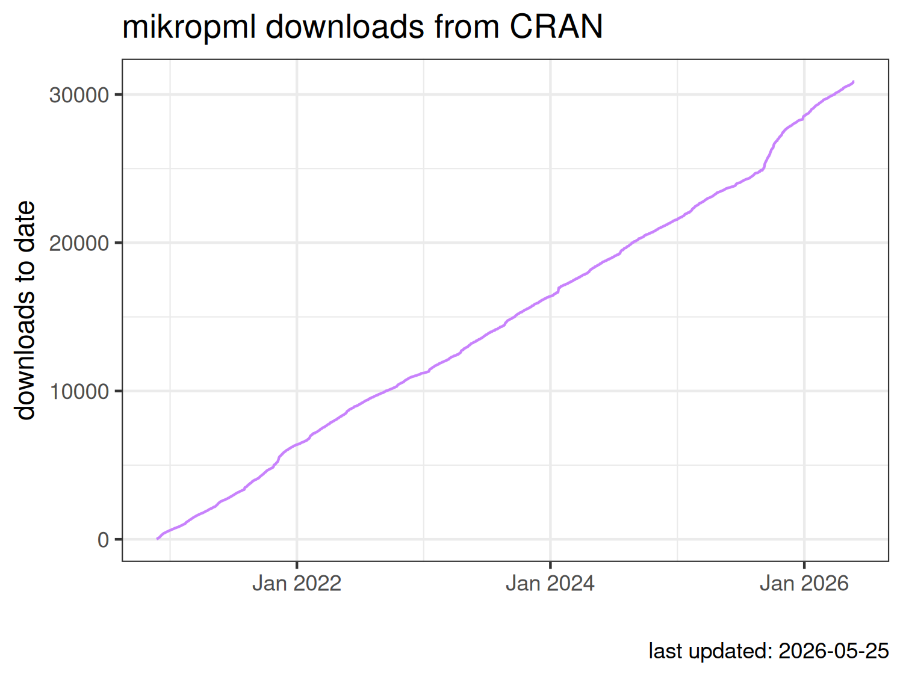

<!-- README.md is generated from README.Rmd. Please edit that file -->

# pkg-downloads

<!-- badges: start -->

[](https://github.com/kelly-sovacool/pkg-downloads/actions/workflows/render-rmarkdown.yaml)
<!-- badges: end -->

[`mikropml`](https://github.com/SchlossLab/mikropml) package download
counts from `cranlogs`

``` r
library(cranlogs)
library(cowplot)
library(glue)
library(magick)
library(rsvg)
library(tidyverse)
```

## Download the downloads

``` r
downloads <- cran_downloads(package = "mikropml",
                            from = "2020-11-23") %>%
    mutate(cum_count = cumsum(count))
write_csv(downloads, here::here('data', 'downloads.csv'))
tail(downloads)
#>            date count  package cum_count
#> 1921 2026-02-25    39 mikropml     29636
#> 1922 2026-02-26     3 mikropml     29639
#> 1923 2026-02-27    19 mikropml     29658
#> 1924 2026-02-28     5 mikropml     29663
#> 1925 2026-03-01     0 mikropml     29663
#> 1926 2026-03-02     0 mikropml     29663
```

## Get the badge

``` r
badge_url <- "https://cranlogs.r-pkg.org/badges/grand-total/mikropml"
badge_img <- magick::image_read_svg(badge_url, width = 1000)
```

## Plot over time

``` r

downloads_plot <- downloads %>% 
    ggplot(aes(date, cum_count)) + 
    geom_line(color = '#c882fc') + 
    scale_x_date(date_labels = "%b %Y") + 
    theme_bw() + 
    labs(x = '', y = 'downloads to date', 
         title = 'mikropml downloads from CRAN',
         caption = glue("last updated: {Sys.Date()}"))

ggdraw() +
    draw_plot(downloads_plot) +
    draw_image(badge_img, 
               x = 0.99, y = 0.99, 
               hjust = 1, vjust = 1, halign = 1, valign = 1,
               width = 0.15)
```

<!-- -->

``` r
ggdraw() +
    draw_plot(downloads_plot)
```

<!-- -->
